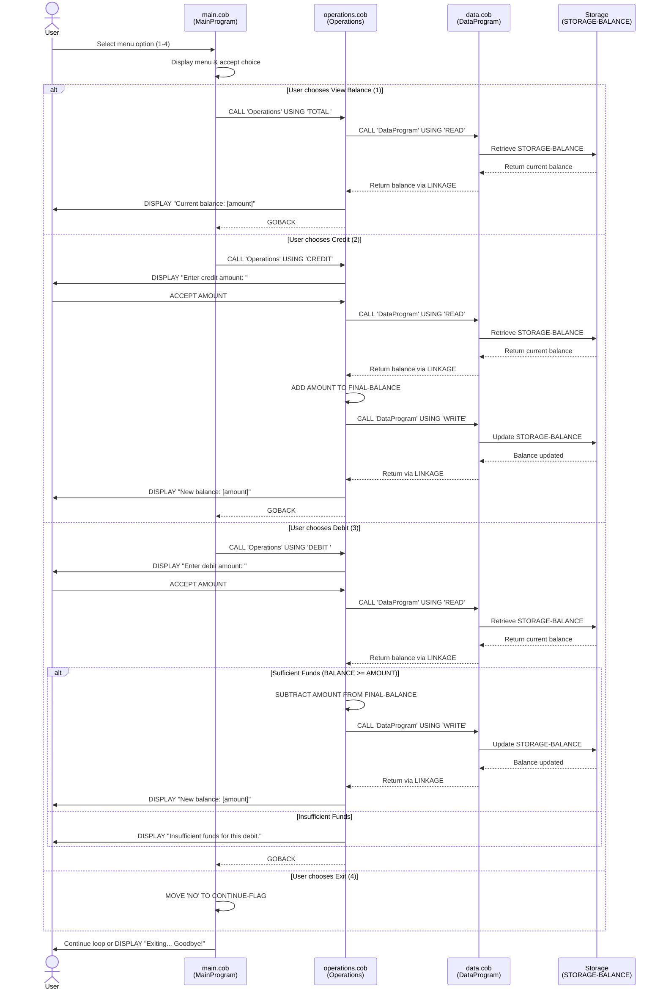

# COBOL Student Account Management System Documentation

## Overview

This is a legacy COBOL-based student account management system designed to handle basic banking operations for student accounts. The system provides a menu-driven interface for viewing account balances, crediting funds, and debiting funds with built-in validation to prevent overdrafts.

## File Structure

### COBOL Programs

#### 1. **main.cob** - Main Program Controller
**Location:** `src/cobol/main.cob`
**Purpose:** Entry point and user interface controller for the account management system.

**Key Functions:**
- Displays a menu-driven interface with four options
- Routes user selections to appropriate operations
- Maintains program flow control with a loop until user chooses to exit
- Handles invalid input gracefully

**Menu Options:**
1. View Balance - Displays current account balance
2. Credit Account - Adds funds to the student account
3. Debit Account - Withdraws funds from the student account
4. Exit - Terminates the program

**Key Components:**
- `USER-CHOICE` - Stores the user's menu selection
- `CONTINUE-FLAG` - Controls the main loop execution

---

#### 2. **data.cob** - Data Storage Module
**Location:** `src/cobol/data.cob`
**Purpose:** Handles persistent data storage and retrieval for account balance information.

**Key Functions:**
- Reads the current account balance from storage
- Writes updated balance information back to storage
- Acts as a bridge between operations and persistent data

**Operations Supported:**
- `READ` - Retrieves the current stored balance
- `WRITE` - Updates and persists the balance value

**Key Components:**
- `STORAGE-BALANCE` - The actual stored account balance (Data type: PIC 9(6)V99, value: 1000.00)
- `OPERATION-TYPE` - Specifies the operation to perform
- `LINKAGE SECTION` - Facilitates parameter passing from calling programs

---

#### 3. **operations.cob** - Business Logic Engine
**Location:** `src/cobol/operations.cob`
**Purpose:** Implements the core business logic and validation rules for account transactions.

**Key Functions:**

**a) View Balance (TOTAL operation)**
- Retrieves and displays the current account balance
- Calls DataProgram to fetch the latest balance

**b) Credit Transaction (CREDIT operation)**
- Prompts user to enter the credit amount
- Retrieves current balance
- Adds the specified amount to the balance
- Persists the new balance
- Displays the updated balance to the user

**c) Debit Transaction (DEBIT operation)**
- Prompts user to enter the debit amount
- Retrieves current balance
- Validates sufficient funds are available
- If valid: Deducts amount and persists new balance
- If invalid: Displays "Insufficient funds" error message
- Displays the updated balance (if successful)

**Key Components:**
- `OPERATION-TYPE` - Type of operation to perform
- `AMOUNT` - Transaction amount (Data type: PIC 9(6)V99)
- `FINAL-BALANCE` - Working variable for balance calculations

---

## Business Rules for Student Accounts

### Account Initialization
- **Default Initial Balance:** 1000.00 currency units
- **Balance Data Type:** Numeric with 6 digits and 2 decimal places (PIC 9(6)V99)

### Transaction Rules

#### Credit (Deposit)
- ✅ Any positive amount can be credited to the account
- ✅ No upper limit validation (unlimited deposits)
- ✅ Balance updates immediately upon transaction completion

#### Debit (Withdrawal)
- ✅ Amount must be less than or equal to current balance
- ❌ **Overdraft Prevention:** Cannot withdraw more than available balance
- ✅ Insufficient funds validation prevents negative balances
- ✅ Transaction is rejected if funds are insufficient

### Session Management
- User remains in the program until explicitly choosing "Exit"
- Invalid menu selections display an error message and re-prompt the user
- Program terminates cleanly with a farewell message

---

## Data Flow Architecture

```
main.cob (User Interface)
    ↓
    └─ Receives user choice
       ├─ TOTAL/CREDIT/DEBIT → operations.cob
       └─ EXIT → Terminates
    
operations.cob (Business Logic)
    ↓
    ├─ For all operations: Calls data.cob with READ to get balance
    ├─ Applies business logic (validation, calculations)
    └─ Updates balance: Calls data.cob with WRITE
    
data.cob (Data Storage)
    ↓
    └─ READ: Returns STORAGE-BALANCE
       WRITE: Updates STORAGE-BALANCE
```

---

## Balance Constraints

| Property | Value |
|----------|-------|
| Minimum Balance | 0.00 |
| Maximum Balance | 999,999.99 |
| Default Balance | 1,000.00 |
| Decimal Places | 2 (cents) |
| Allowed Operations | Credit, Debit (with validation) |

---

## Data Flow Sequence Diagram

The following diagram illustrates the complete data flow between system components for all transaction types:



---

## Notes for Modernization

This legacy COBOL system demonstrates several patterns that could be modernized:
- **Menu Loop:** Could be replaced with web UI or REST API
- **In-Memory Storage:** Could be replaced with a relational database
- **Direct Program Calls:** Could be replaced with microservices architecture
- **Input Validation:** Could be enhanced with comprehensive error handling
- **Insufficient Funds Rule:** Could be extended with transaction logging and audit trails
- **User Authentication:** No authentication currently implemented
- **Concurrency:** No concurrent transaction handling

